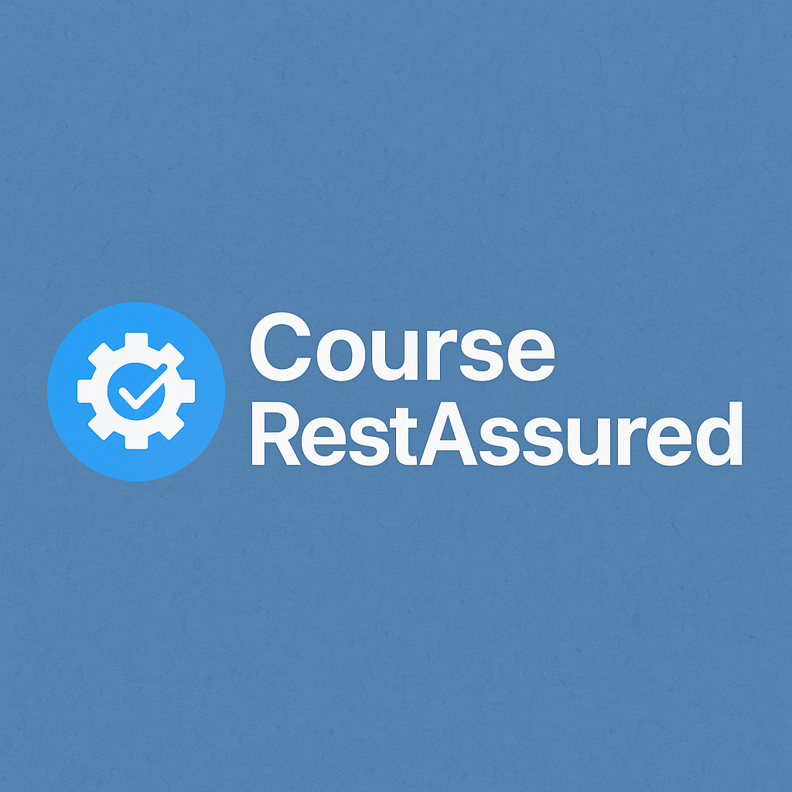

🎯 CourseRestAssured

🔬 Automação de testes de APIs REST com Java, JUnit 4 e RestAssured
📚 Material de apoio ao curso Testando API REST com REST Assured, disponível na Udemy.

🗂️ Estrutura do Projeto
bash
Copiar
Editar
CourseRestAssured/
│
├── src/
│   ├── main/java/br/ce/wcaquino/
│   │   ├── Main.java
│   │   └── OlaMundo.java
│   └── test/java/br/ce/wcaquino/
│       ├── OlaMundoTest.java
│       ├── UserJsonTest.java
│       └── UserXMLTest.java
│
├── .vscode/        # Configurações do VS Code (ignorado no Git)
├── .idea/          # Configurações do IntelliJ (ignorado no Git)
├── target/         # Arquivos gerados pelo Maven (ignorado no Git)
├── pom.xml         # Gerenciador de dependências Maven
└── README.md
🚀 Como Executar os Testes
✅ Pré-requisitos
☕ Java 17+

🧰 Maven 3.6+

🧪 (Opcional) VS Code com a extensão Java Test Runner

▶️ Via Maven
bash
Copiar
Editar
mvn test
▶️ Via VS Code
Abra o arquivo de teste desejado em src/test/java/br/ce/wcaquino/

Clique no botão "Run Test" acima do método ou da classe de teste

🧪 Sobre os Testes
📌 Principais Classes
Classe	Descrição
OlaMundoTest.java	Testes básicos de GET, status code, corpo da resposta e uso de matchers.
UserJsonTest.java	Validações em JSON: campos, listas, e cenários de erro.
UserXMLTest.java	Validações em XML: nós, atributos e listas.

✔️ Exemplos de Validações
✅ Status code da resposta

✅ Conteúdo do corpo da resposta

✅ Uso de Hamcrest Matchers

✅ Validação de listas e coleções

✅ Mensagens de erro e cenários negativos

📦 Dependências
Todas configuradas no pom.xml:

Biblioteca	Versão
RestAssured	5.4.0
JUnit	4.13.2
Hamcrest	2.2

💡 Observações
🌐 Os testes utilizam endpoints públicos do domínio: restapi.wcaquino.me

📘 Projeto didático, ideal para estudos e práticas de automação

🧹 Pastas como .vscode/, .idea/ e target/ estão no .gitignore

📄 Licença
📚 Este projeto é disponibilizado exclusivamente para fins educacionais.